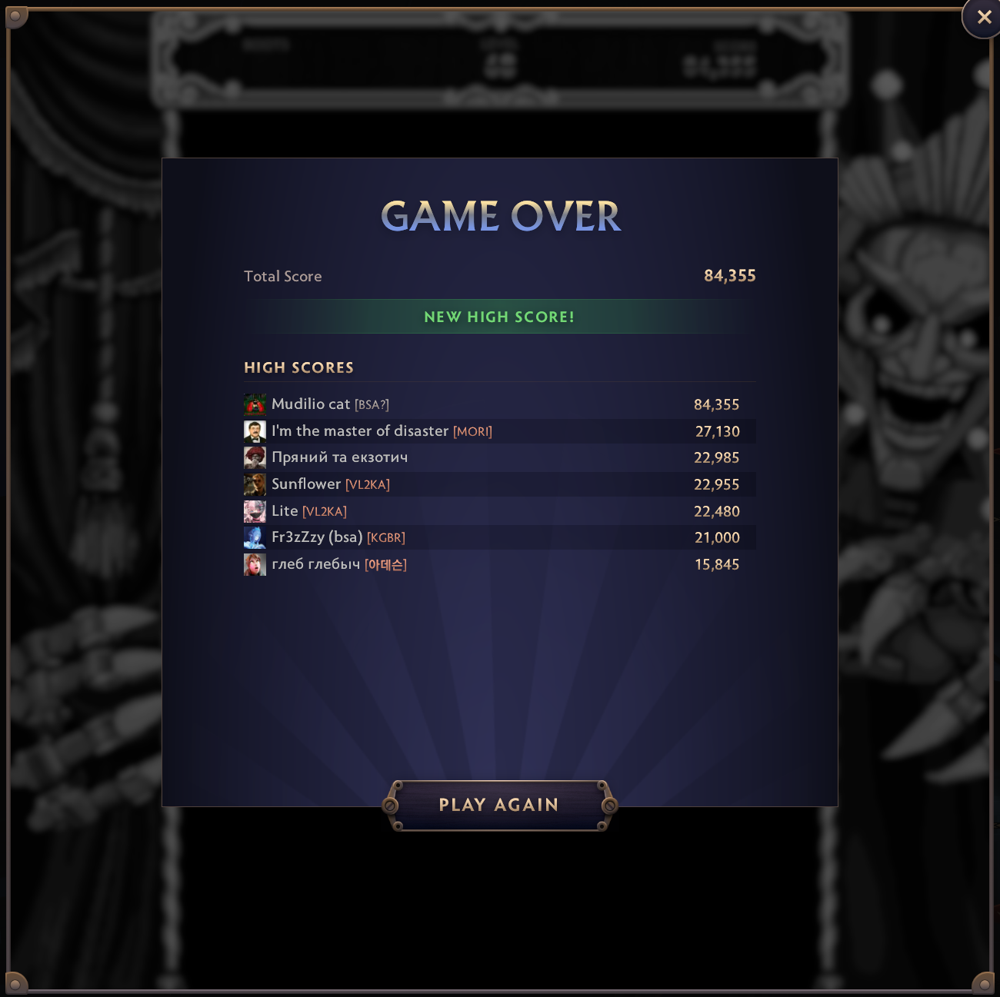
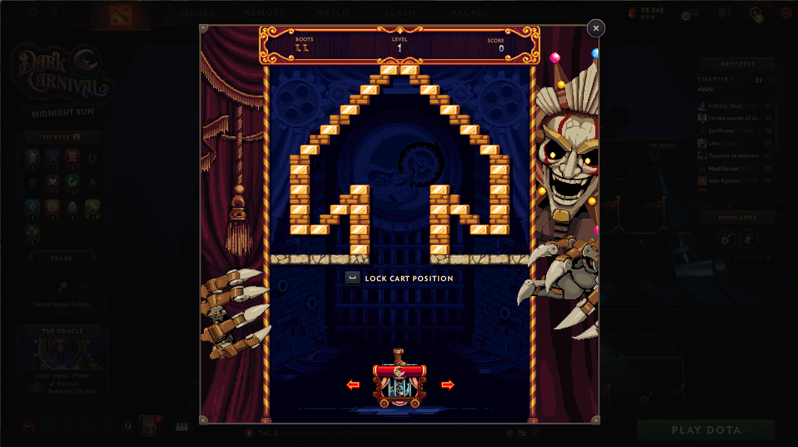
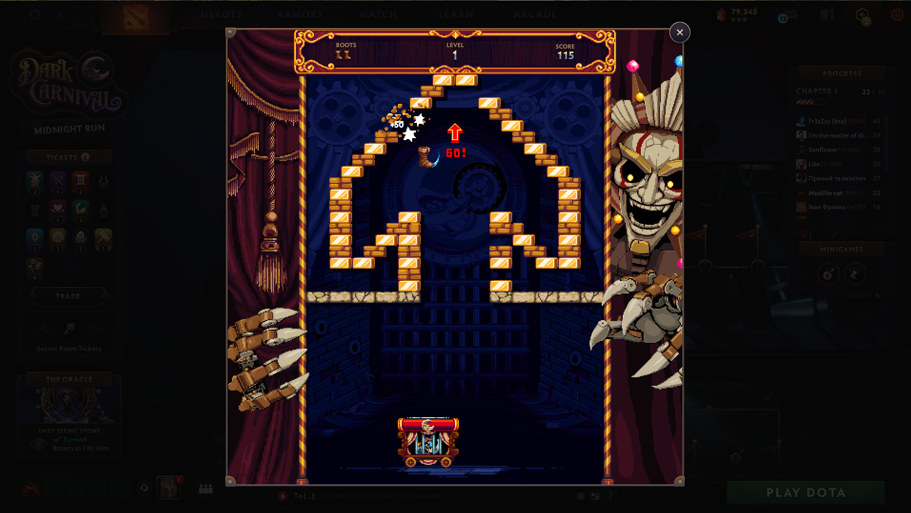

# 🥾 Dota 2 Boot Breaker Bot

> A computer-vision **auto-player for the Boot Breaker arcade minigame** from Dota 2's **Dark Carnival** event. It watches the screen, identifies the flying boot by its cyan spin arc, and drives the cart with synthetic key presses — clearing level after level unattended.
>
> **Best recorded run: 84,355 points, 60+ levels cleared in a single hour-long session.**

No game files are read or modified, no memory access, no injection. The bot only *looks at pixels* (screen capture) and *presses keys* (Space / A / D posted to the Dota window). It is an external autoplayer in the purest sense.

<p align="center">
  
  <br><em>One unattended session: 84,355 points — over 3× the previous leaderboard record.</em>
</p>

| Lock & aim | Boot in flight |
|:---:|:---:|
|  |  |

## How it works

- **Capture** — [`mss`](https://github.com/BoboTiG/python-mss) grabs the minigame panel ~46–60×/s. The panel is auto-located on **any monitor** by its ornate gold frame (candidates are scored by saturation × area, so a second monitor can't shadow the real game).
- **Boot identity** — candidate blobs are moving orange pixels, but the game rains gold look-alikes (falling coins, "+50" score popups, impact sparkles, shimmering blocks, brick debris). The real boot is the only object with a bright **cyan spin arc**, so every candidate must carry one. This single test is what makes tracking junk-proof (validated on 531 hand-labeled blobs: 34/34 junk rejected, ~100% of boot detections kept).
- **Tracker** — predictive search ROI → distance gate → velocity measured between accepted detections → brief coast, then full-field re-acquisition. "Impossible motion" breakers drop any lock that stops dead mid-air (a real boot never does).
- **Steering** — bang-bang A/D with hysteresis and a small momentum lookahead, tuned against 573 recorded cart-line crossings.
- **Game state** — level flow is followed via the field's color saturation (loading dip → fade-in), and a boot exiting through the top of a broken wall is recognized as **level complete**.
- **Input** — keys go straight to the Dota window via `PostMessage`: the bot never clicks and never steals focus. Dota just has to be the foreground window.

## Requirements

- **Windows 10/11** (Win32 APIs for input)
- **Python 3.10+** — install from the [Microsoft Store](https://apps.microsoft.com/detail/9NCVDN91XZQP) or [python.org](https://www.python.org/downloads/windows/)
- `pip install -r requirements.txt` — opencv-python, numpy, mss, keyboard
- **Dota's UI frame rate capped at 60**: open the Dota 2 console and run `fps_max_ui 60`. The minigame's physics speed is tied to its render rate; the bot is tuned and tested at 60 fps.
- Terminal **run as Administrator** — the `keyboard` library needs it so the global `s`/`q` hotkeys work while Dota has focus.

## Tested on

- **3440×1440 ultrawide**, Dota in borderless fullscreen, `fps_max_ui 60`
- Multi-monitor setups (game on either monitor — auto-detected)

**Other resolutions:** the field is auto-detected from the modal's gold frame, and every detection constant is a fraction of the field size, so common resolutions ≥1080p should work — but only 3440×1440 has actually been tested. If detection misbehaves: `--grab` shows what each monitor capture looks like, `--dry-run` watches detections without pressing any keys, `--calibrate` pins the field manually.

## Quick start

**No Python?** Grab `BootBreakerBot.exe` from [Releases](https://github.com/glazunovds/dota2_boot_catcher/releases) — same flags, no install. Run it from an **Administrator** terminal (`BootBreakerBot.exe --manual`). Windows SmartScreen will warn because the exe is unsigned — "More info → Run anyway". `config.json`, `debug/` and logs are created next to the exe.

1. In Dota: console → `fps_max_ui 60`. Open Dark Carnival → **Boot Breaker** and press **PLAY** yourself.
2. Click once inside the game field and keep Dota in the foreground.
3. In an **Administrator** terminal:

   ```
   pip install -r requirements.txt
   python main.py --manual
   ```

4. Press **`s`** — the bot locks, throws and catches on its own, level after level. Hold **`q`** to stop after the current boot; `Ctrl+C` quits.

**Tips**

- Disable **Steam overlay notifications** for Dota — a "friend is online" popup can silently eat the bot's key presses (the bot rings the terminal bell and tells you when that happens).
- Don't click other windows mid-run: posted keys only reach Dota while it is the foreground window.
- Debug frames + per-tick telemetry are written to `debug/` (cleared on each start) — invaluable if you want to see exactly what the bot saw.

## Flags

| Flag | Meaning |
|---|---|
| `--manual` | **Recommended.** No clicks, no focus grabbing — you press PLAY and focus the game; the bot only sends Space/A/D. |
| *(none)* | Legacy auto mode: also clicks the PLAY button and brings Dota to the front. |
| `--monitor N` | Force capture of monitor N (1 = first). Default: auto-scan all monitors. |
| `--calibrate` | Pin the field region manually (point the mouse at the gold frame corners). |
| `--dry-run` | Detect and save debug frames, press no keys (`--dry-seconds S` sets duration). |
| `--grab` | Save one screenshot per monitor and exit — capture troubleshooting. |
| `--snapshot NAME` | Save one field screenshot and exit. |
| `--no-auto-play` | Auto mode without the PLAY click. |
| `--no-debug` | Don't save debug frames (saves disk). |
| `--debug-dir DIR` | Where debug frames go (default `debug/`). |
| `-v` | Verbose logging. |

## Known limits

- On late levels the boot's base speed grows and each bounce accelerates it further; a boot squeezed through a one-block gap at a wall can rebound faster than the cart can physically react. A handful of lost boots per long session is normal (lives regenerate as levels are cleared).
- Frames the game never rendered (loading hitches) are invisible to any screen-capture bot.

## Status

Delivered **as-is**: built and battle-tested for one event minigame on one machine, and not planned to be maintained. If Valve changes the minigame art — especially the boot sprite or its cyan spin arc — detection will need re-tuning.

---

*Keywords: dota 2, dota2, boot breaker, dark carnival, minigame, bot, autoplayer, auto-player, arkanoid, breakout, brick breaker, computer vision, opencv, python, screen capture, mss, object tracking, game automation, pixel bot, no injection*
